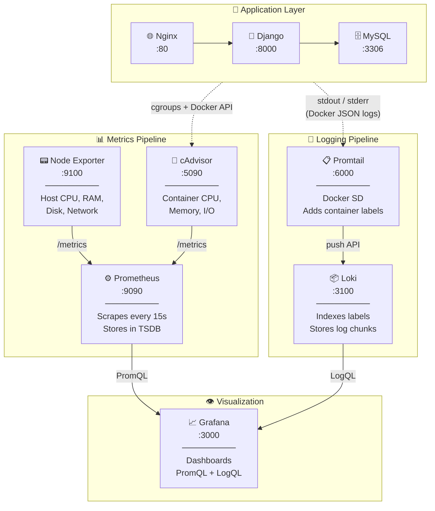

# Monitoring & Logging Stack — Full Workflow

## Architecture Overview

Your stack has **two pipelines** running side by side:



| Pipeline | Purpose | Tools |
|----------|---------|-------|
| **Metrics** | CPU, RAM, disk, network, per-container resource usage | Node Exporter → Prometheus → Grafana |
| **Logging** | Container stdout/stderr logs, error filtering | Promtail → Loki → Grafana |
| **Visualization** | Dashboards for both metrics + logs | Grafana |

---

## Config Files & What They Do

### 1. [prometheus.yml](file:///home/coldzera/Desktop/django-notes-app/prometheus.yml) — Metrics Scraping

Prometheus **pulls** (scrapes) metrics from targets every 15 seconds.

```yaml
scrape_configs:
  - job_name: "prometheus"        # Prometheus monitors itself
    targets: ["prometheus:9090"]

  - job_name: "node-exporter"     # Host-level metrics (CPU, RAM, disk)
    targets: ["node_exporter:9100"]

  - job_name: "cadvisor"          # Per-container metrics (CPU, memory, I/O)
    targets: ["cadvisor:8080"]
```

**How it works:** Every 15s, Prometheus sends HTTP GET requests to each target's `/metrics` endpoint. The target responds with metrics in Prometheus text format. Prometheus stores this in its time-series database at `./data/prometheus`.

---

### 2. [promtail-config.yaml](file:///home/coldzera/Desktop/django-notes-app/promtail-config.yaml) — Log Collection

Promtail **discovers** Docker containers and **pushes** their logs to Loki.

```yaml
scrape_configs:
  - job_name: docker
    docker_sd_configs:                              # ← Auto-discovers containers via Docker socket
      - host: "unix:///var/run/docker.sock"
        refresh_interval: 5s
    relabel_configs:
      - source_labels: ["__meta_docker_container_name"]
        target_label: "container"                   # ← Adds "container" label (e.g., "nginx_cont")
      - source_labels: ["__meta_docker_container_id"]
        target_label: "container_id"
    pipeline_stages:
      - docker: {}                                  # ← Parses Docker JSON log format
```

**How it works:**
1. Promtail connects to the Docker socket ([/var/run/docker.sock](file:///var/run/docker.sock))
2. Every 5s, it discovers all running containers
3. For each container, it reads log files from `/var/lib/docker/containers/<id>/*-json.log`
4. `relabel_configs` extracts the container name and adds it as a `container` label
5. `docker: {}` pipeline stage parses Docker's JSON log format (extracting timestamp, stream, log message)
6. Logs are pushed to Loki at `http://loki:3100/loki/api/v1/push`

> [!IMPORTANT]
> **This is why per-container filtering works.** Without `docker_sd_configs` + `relabel_configs`, logs only had a generic `job="docker"` label with no way to tell containers apart. The `relabel_configs` section is what adds the `container` label that your per-container dashboard uses.

---

### 3. [loki-config.yaml](file:///home/coldzera/Desktop/django-notes-app/loki-config.yaml) — Log Storage

Loki is the **log database**. It stores and indexes logs received from Promtail.

Key settings:
| Setting | Value | Purpose |
|---------|-------|---------|
| `auth_enabled` | `false` | No authentication (single-tenant mode) |
| `storage.filesystem` | chunks + rules dirs | Stores log data on local filesystem |
| `schema: v13` with `store: tsdb` | Latest schema | Uses TSDB for efficient indexing |
| `embedded_cache: 100MB` | Query cache | Speeds up repeated queries |
| `replication_factor: 1` | Single instance | No replication (single-node setup) |

**How it works:** Loki doesn't index log content (unlike Elasticsearch). It only indexes **labels** (like `container`, `job`). When you query `{container="nginx_cont"}`, Loki finds all log chunks with that label and then does a brute-force search through those chunks. This is why it's lightweight but still fast for label-based filtering.

---

### 4. [docker-compose.yml](file:///home/coldzera/Desktop/django-notes-app/docker-compose.yml) — Container Definitions

| Service | Image | Port | Role |
|---------|-------|------|------|
| `nginx` | nginx | :80 | Reverse proxy for Django |
| `django_app` | django_app (custom) | :8000 | Your application |
| `db` | mysql | 3306 (internal) | Database |
| `prometheus` | prom/prometheus | :9090 | Metrics storage + scraping |
| `node_exporter` | prom/node-exporter | :9100 | Exposes host metrics |
| `cadvisor` | gcr.io/cadvisor | :5090 | Exposes container metrics |
| `loki` | grafana/loki | :3100 | Log storage |
| `promtail` | grafana/promtail | :6000 | Log collector |
| `grafana` | grafana/grafana | :3000 | Visualization UI |

**Key volume mounts:**
- `./data/grafana:/var/lib/grafana` — Persists Grafana dashboards & settings
- `./data/prometheus:/prometheus` — Persists metrics data
- [/var/run/docker.sock](file:///var/run/docker.sock) — Lets Promtail & cAdvisor access Docker API
- `/var/lib/docker/containers` — Lets Promtail read container log files

---

## Dashboards

### Dashboard 1: [grafana-dashboard.json](file:///home/coldzera/Desktop/django-notes-app/grafana-dashboard.json) — Full Monitoring & Logging

Uses **both** Prometheus + Loki. Shows:
- 🖥️ **Host Overview** — CPU, Memory, Disk gauges + time series + network traffic
- 🐳 **Container Metrics** — Per-container CPU, memory, network (from cAdvisor via Prometheus)
- 📝 **Logs** — Log volume chart, all container logs combined, error-only logs

### Dashboard 2: [grafana-logs-dashboard.json](file:///home/coldzera/Desktop/django-notes-app/grafana-logs-dashboard.json) — Per-Container Logs

Uses **Loki only**. Shows:
- 🟢 **All Logs** — Individual log panel per container (nginx, django, db, grafana, loki, promtail, prometheus, node_exporter, cadvisor)
- 🔴 **Error Logs** — Error-filtered panel per container (matches `error|fatal|exception|fail|critical|traceback`)

---

## End-to-End Data Flow

### Metrics Flow
```
Host OS → Node Exporter (exposes /metrics) → Prometheus (scrapes every 15s, stores in TSDB)
Docker → cAdvisor (reads cgroups, exposes /metrics) → Prometheus → Grafana (PromQL queries)
```

### Logging Flow
```
Container stdout/stderr → Docker writes JSON logs → Promtail (discovers via Docker socket,
   reads logs, adds container label, parses JSON) → pushes to Loki → Grafana (LogQL queries)
```

### Query Examples
| Query | Language | What it shows |
|-------|----------|---------------|
| `rate(node_cpu_seconds_total{mode="idle"}[5m])` | PromQL | Host CPU idle rate |
| `container_memory_usage_bytes{name="django_cont"}` | PromQL | Django container memory |
| `{container="nginx_cont"}` | LogQL | All Nginx logs |
| `{container="django_cont"} \|~ "(?i)error"` | LogQL | Django error logs only |
